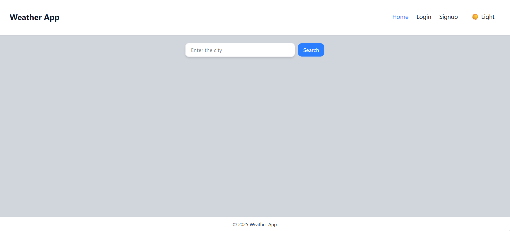
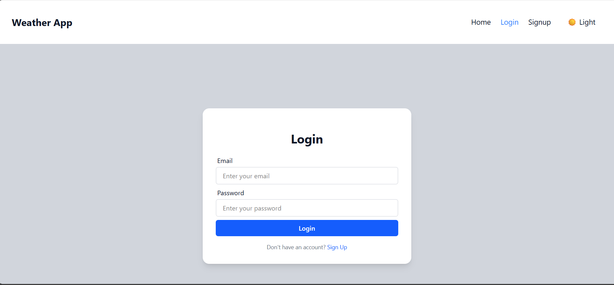
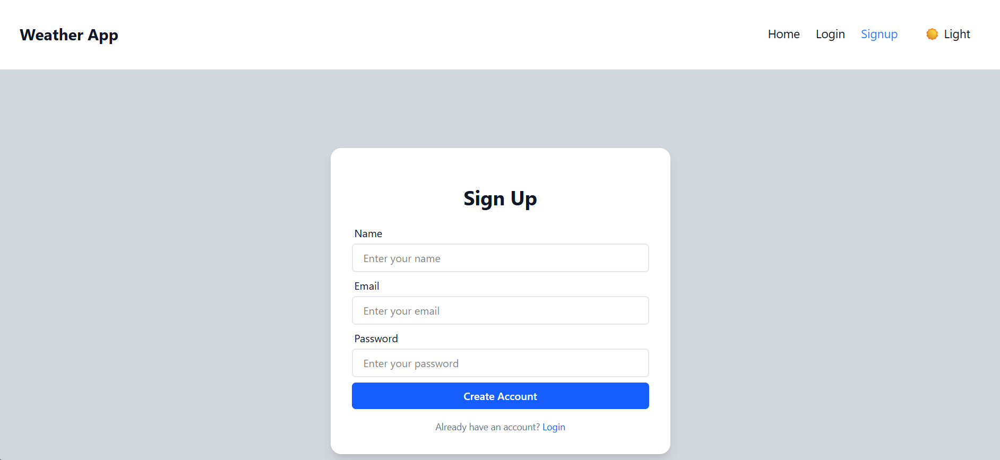
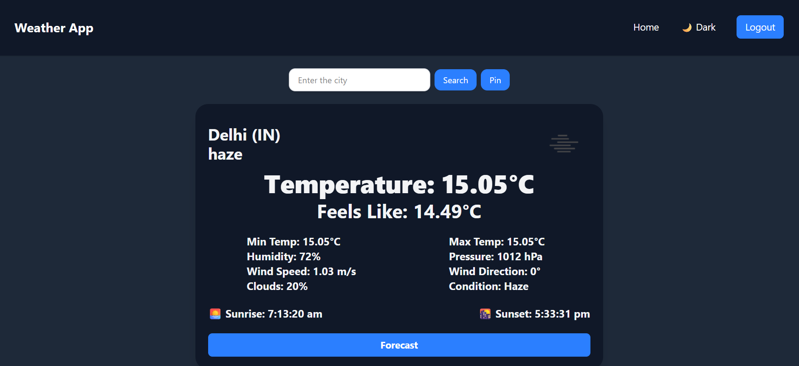
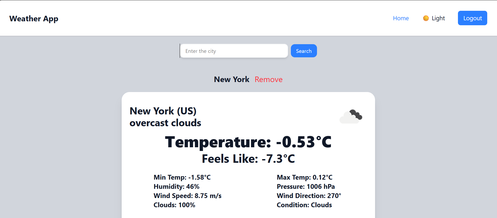
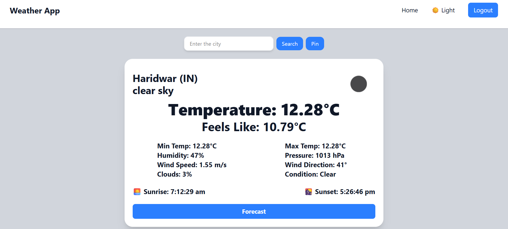
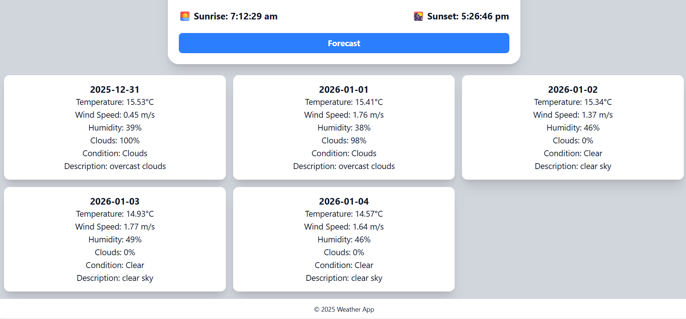

# Weather App 🌦️

A sleek weather application that fetches real-time data and presents it with a polished UI. Built to demonstrate API integration, error handling, responsive design, and professional documentation.

## 🔗 Live demo

👉 https://weather-app-xi-three-74.vercel.app

## 🚀 Features

- **City search:** Find current weather by city name
- **Real-time data:** API integration with OpenWeatherMap
- **Loading states:** Smooth transitions and feedback
- **Error handling:** Invalid cities, network issues, API failures
- **Responsive UI:** Mobile to desktop
- **Dark mode:** Accessible, modern theming
- **Documentation:** Clear, concise, recruiter-focused

## 🛠️ Tech Stack

- Frontend: React, Redux Toolkit, Vite
- Styling: Tailwind CSS
- API: OpenWeatherMap
- Backend & Services: Appwrite (authentication + pinned cities storage)
- Deployment: Vercel
- Version Control: Git/GitHub

---

## 📦 Installation

```bash
git clone https://github.com/ViditTyagi17/Weather-app.git
cd weather-app
npm install
npm run dev
```

---

## 🔧 Environment variables

Create a `.env` file in the project root. All variables prefixed with `VITE_` are exposed to the client at build time.
The following variables are required:

```bash
VITE_APPWRITE_URL=""
VITE_APPWRITE_PROJECT_ID=""
VITE_WEATHER_API_KEY=""
VITE_APPWRITE_DATABASE_ID=""
VITE_APPWRITE_TABLE_ID=""

```

---

## 🔑 Key Implementation Notes

- **Guest homepage:** When not logged in, the home page shows only the search input. Users can search and view weather data for a city, but they cannot pin cities until they create an account.
- **Logged‑in homepage (dashboard):** Displays pinned cities with their current weather data and a button to fetch a 4–5 day forecast. The search input remains available for new queries.
- **City detail page:** When a logged‑in user searches for a city, they are taken to a dedicated city page showing current data, a forecast button, and a pin button (only if the city is not already pinned).
- **Pin button logic:**
  - Hidden on the logged‑in homepage (since cities there are already pinned).
  - Visible on city detail pages for unpinned cities, allowing users to add them to the dashboard.
  - Not available for guests — pinning requires an account.
- **Search input:** Weather data is requested only when the user presses Enter or clicks the Search button, ensuring efficient API usage.
- **Loading experience:** A reusable loader component provides consistent feedback during data fetches (initial load, city searches, forecast requests).
- **Error handling:** Clear, user‑friendly messages are displayed — “City not found” for invalid queries and “Something went wrong” for network or API errors.
- **Units and language:** Weather information is presented in Celsius and English by default, with configuration managed through environment variables for easy extension.
- **Theme persistence:** Dark mode preference is stored in localStorage and applied early to prevent theme flash. Tailwind CSS ensures accessible contrast ratios.
- **Code organization:** API client logic is isolated in utility modules, while UI components remain presentational. Redux slices manage side effects to maintain separation of concerns.
- **Defensive parsing:** API responses are validated with safe defaults to guard against missing fields, preventing UI breakage or NaN values.

---

## 📂 Project structure

```
WeatherApp/
├── node_modules/               # Project dependencies
├── public/
│   └── screenshot/            # Contains screenshots used in README documentation
│       └── screenshot.png     # Example image for visual reference
├── src/
│   ├── appwrite/              # Appwrite service logic
│   │   ├── auth.js            # Signup/login functions
│   │   └── pinnedCitiesService.js  # Pin/unpin city logic
│   ├── Components/            # Reusable UI components
│   ├── conf/                  # Configuration files (e.g., Appwrite setup)
│   ├── features/              # Redux slices grouped by domain
│   │   ├── auth/
│   │   │   └── authSlice.js   # Auth state and reducers
│   │   ├── History/
│   │   │   └── historySlice.js # Search history logic
│   │   ├── mode/
│   │   │   ├── themeSlice.js  # Dark/light mode state
│   │   │   └── useTheme.js    # Custom hook for theme toggling
│   │   └── weather/
│   │       ├── pinnedCitiesSlice.js   # State for pinned city names
│   │       ├── pinnedWeatherSlice.js  # State for pinned city weather data
│   │       ├── weatherAPI.js          # API client for weather data
│   │       └── weatherSlice.js        # State for searched city weather
│   ├── Pages/                 # Route-based pages
│   │   ├── Home.jsx           # Dashboard or guest homepage
│   │   ├── Login.jsx          # Login form
│   │   ├── NotFound.jsx       # 404 fallback
│   │   ├── SearchResult.jsx   # City detail page
│   │   └── Signup.jsx         # Signup form
│   └── redux/
│       └── store.js           # Redux store configuration
├── .env                       # Environment variables (local)
├── .env.sample                # Sample env file for contributors
├── .gitignore                 # Files to exclude from Git
├── eslint.config.js           # ESLint configuration
├── index.html                 # Vite entry HTML
├── index.css                  # Global styles
├── App.jsx                    # Root component
├── main.jsx                   # Entry point for React
├── package.json               # Project metadata and scripts
├── package-lock.json          # Dependency lock file
├── README.md                  # Project overview and instructions
├── vercel.json                # Vercel deployment config
└── vite.config.js             # Vite build configuration
```

---

## 🧪 Linting and quality

- **ESLint:** React and hooks rules enabled
- **Scripts:** `npm run lint` to check code quality

---

## 💡 Challenges solved

- **Guest vs logged‑in flow:** Designed separate experiences — guests can search and view weather but cannot pin cities, while logged‑in users have a dashboard with pinned cities and forecast buttons.
- **Pin button logic:** Ensured the pin button only appears on city detail pages for unpinned cities, is hidden on the dashboard, and is unavailable for guests.
- **Forecast integration:** Added a forecast button directly on city cards so users see current weather immediately and can expand to a 4–5 day forecast on demand.
- **Search efficiency:** Prevented excessive API calls by triggering fetch only on Enter key or Search button click.
- **Error clarity:** Normalized API and network errors into simple, user‑friendly messages (“City not found” vs “Something went wrong”).
- **Theme persistence:** Solved the “flash of light mode” issue by applying dark mode early from localStorage.
- **Resilience:** Implemented defensive parsing with safe defaults to handle missing API fields gracefully, preventing UI breakage or NaN values.
- **Code organization:** Separated API client logic, Redux slices, and presentational components to keep the codebase clean and maintainable.

---

## 📸 Screenshots

### Home Page (Not Logged In)



### Login



### Sign Up



### Dark Mode



### Dashboard (Logged In with Pinned Cities)



### City Card with Forecast and Pin Button



### Forecast Expanded



---

## 🔮 Future improvements

- **Geolocation-based weather**

---

## 👨‍💻 Author

- **Vidit Tyagi** — Aspiring Web Developer focused on recruiter-ready projects
- GitHub: https://github.com/ViditTyagi17

---
